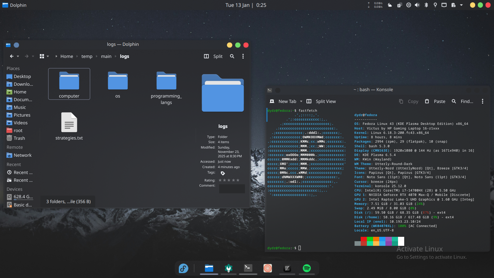

# Titanium Dark Theme

    

## What is Titanium?

Titanium is my kde dark theme package (there is no light version sorry) that I am currently using and continue to improve. This package basically gathers the components from several themes and packages and also has a little **magical touch** of mine. I started to this because of easily reconstruct my theme when I switch a new machine or start to try a new linux distro. But in early stages of development I decided to share with all other people.

**I hope you like it.**

## What does Titanium do?

Titanium downloads the several different themes to your computer and mixes itself with them. It also makes several system file changes too. 

If you want to revert the changes, the changes are:

    It adds **BorderlessMaximizedWindows=true** line to your kwinrc file in directory "$HOME/.config/kwinrc"

    Downloads kvantum ( you can delete it with **sudo dnf/apt/pacman remove kvantum** )

    It sets itself as default theme in kvconfig file in directory "$HOME/.config/Kvantum/kvantum.kvconfig"
  
I am considering to add an uninstall.sh file to make this process automatic but you can use this method until I add it.

**Note: "Activate linux" watermark is not included.**

## How to set Titanium?

Seting Titanium is so simple just:
  
  Clone repository:
    
    git clone "https://github.com/drkdd/Titanium-Dark.git"
    
  Go to folder:
  
    cd Titanium-Dark
    
  Give permission to script:
  
    chmod +x install.sh
    
  Run script:
  
    ./install.sh
    
  And thats it!
  
  (Now you can delete folder if you want, all files are copied to necessarry locations)

Removing Titanium :

  Give permission to uninstallation script:
  
    chmod +x uninstall.sh
    
  Run script:
    
    ./uninstall.sh

##  🌟 Credits & Acknowledgments

This theme is a compilation of several amazing open-source projects. I have modified colors and configurations to bring them together. All credit goes to the original creators:

    Plasma Style: Based on Utterly Round by himdek 

    Icons: Papirus by x-varlesh-x 

    Kvantum Theme: Modified version of Utterly Nord by himdek
    
    Splash Screen : Modified version of Fedora Minimalistic by freezykaif
